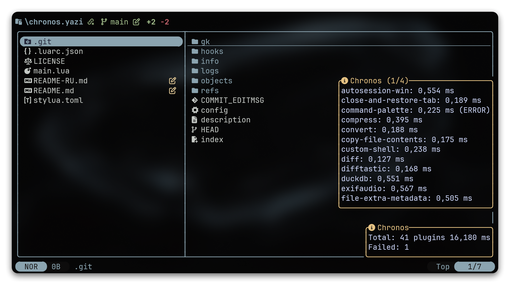

<h1 align="center">⏱️ chronos.yazi</h1>
<p align="center">
  <b>Benchmarks load time of all installed external plugins on <a href="https://github.com/sxyazi/yazi">yazi</a> startup</b><br>
</p>

<p align="center">
  
</p>

---

> [!TIP]
> **Russian version:** [README-RU.md](README-RU.md)

## Installation

> [!IMPORTANT]
> Requires Yazi v26.5.6+

```sh
ya pkg add WhoSowSee/chronos
```

```sh
# Manual installation

# Linux/macOS
git clone https://github.com/WhoSowSee/chronos.yazi.git ~/.config/yazi/plugins/chronos.yazi

# Windows
git clone https://github.com/WhoSowSee/chronos.yazi.git $env:APPDATA\yazi\config\plugins\chronos.yazi
```

## Setup

```lua
require("chronos"):setup({
	enable = true,
	notify_mode = "summary", -- "summary" | "detailed"
	detail_chunk_size = 12,
})
```

> [!IMPORTANT]
> Place this call **at the very top of `init.lua`**, before any other `require(...)`. Lua caches modules after the first `require`, so any plugin loaded earlier in `init.lua` would otherwise be measured as a near-zero cache hit. Chronos clears each plugin's cache entry before measuring it.

## Options

- `enable` (default: `false`): enable/disable startup benchmark
- `notify_mode` (default: `"summary"`):
  - `summary`: single total notification
  - `detailed`: total + plugin timings split into multiple notifications
- `detail_chunk_size` (default: `12`): number of plugin rows per detailed page. Must be a positive integer. If a page is taller than your terminal, Yazi's notification renderer will clip it — pick a smaller value if that happens

## Star History

<p align="center">
  <a href="https://starchart.cc/WhoSowSee/chronos.yazi">
    <picture>
      <source
        media="(prefers-color-scheme: dark)"
        srcset="https://starchart.cc/WhoSowSee/chronos.yazi.svg?variant=custom&background=%230d1117&axis=%238b949e&line=%232f81f7"
      />
      <source
        media="(prefers-color-scheme: light)"
        srcset="https://starchart.cc/WhoSowSee/chronos.yazi.svg?variant=custom&background=%23ffffff&axis=%2357606a&line=%230969da"
      />
      
    </picture>
  </a>
</p>

<p align="center">
  
</p>

<p align="center">
  <i><code>&copy 2026-present <a href="https://github.com/WhoSowSee">WhoSowSee</a></code></i>
</p>

<p align="center">
  <a href="https://github.com/WhoSowSee/chronos.yazi/blob/main/LICENSE"></a>
</p>
